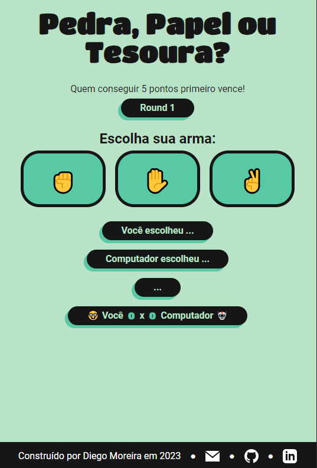

# Rock Paper Scissors Game

This project was proposed as part of the curriculum of The Odin Project to practice pure JavaScript. The app's primary language is Brazilian Portuguese. I have recently rewritten the script and a portion of the CSS.

## How to play

Visit [diego-moreira8.github.io/odin-rock-paper-scissors-project](https://diego-moreira8.github.io/odin-rock-paper-scissors-project/) to play the game. You will compete against the computer. Click on one of the three weapon buttons to make your move. The computer's move is randomly generated. The results and the current score are displayed just below the weapon buttons. The first player to reach a score of 5 wins the game!
